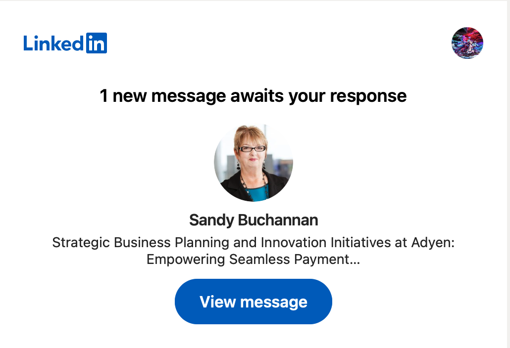
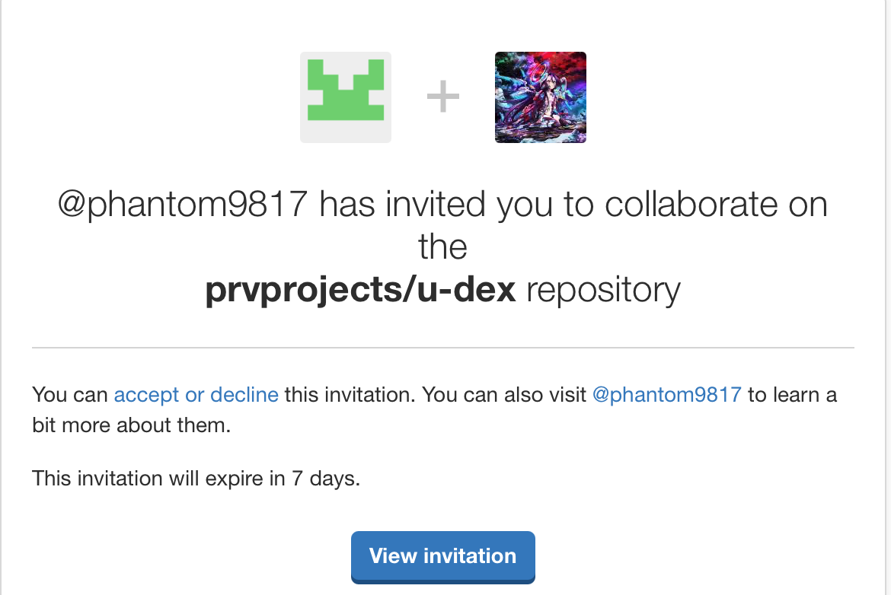
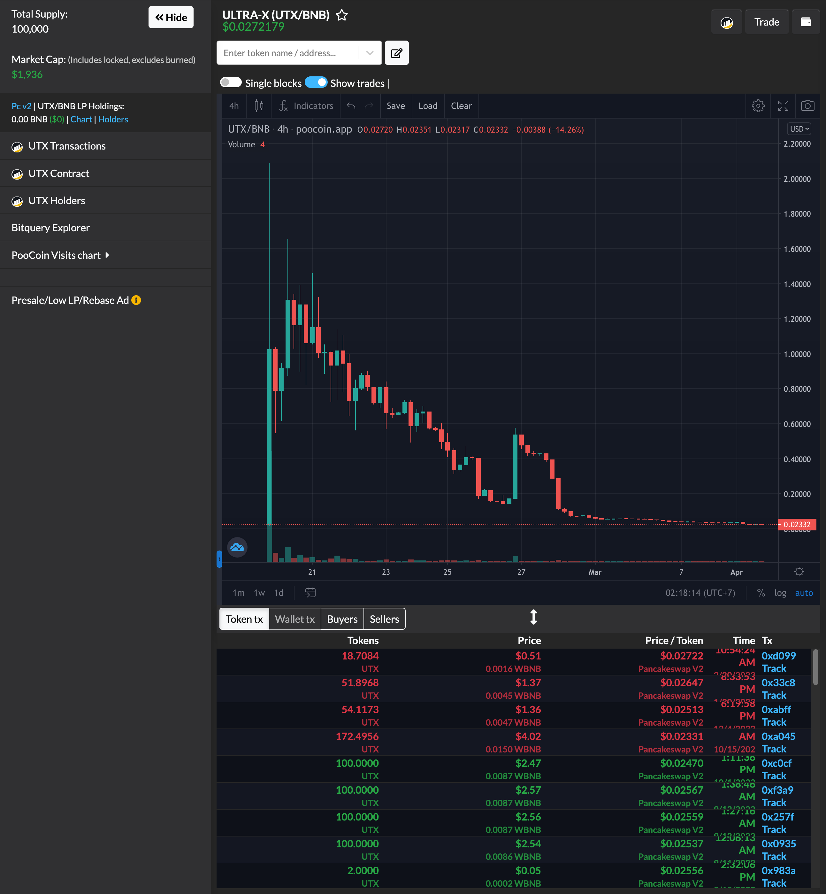
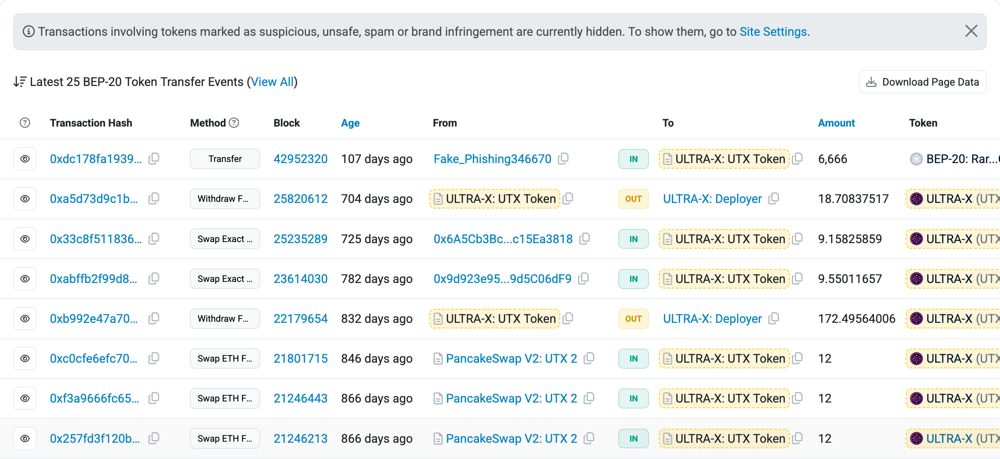
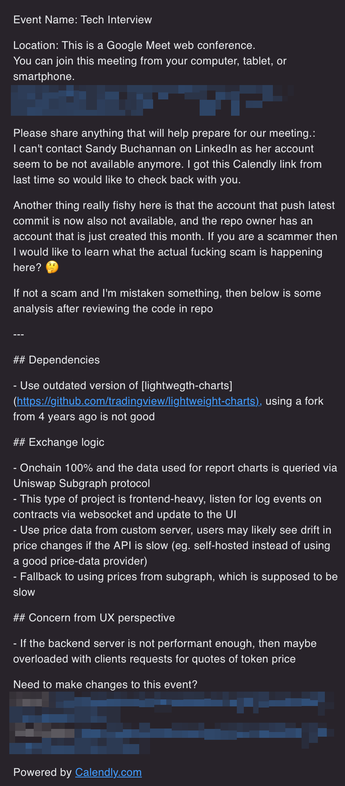

# A 4-year old source code being stolen and used for hiring scam?

Let's see what the actual fuck is in this shit.

Originally invited to private project at [github.com/prvprojects/u-dex](https://github.com/prvprojects/u-dex), the owner is an account just created in Jan 2025, and the first contributor with source code commit is an account created just months ago. Really suspicious...💡

The fake recruiter initially contacted me via LinkedIn using a portrait that look like a stolen picture from someone not in tech (I happen to just study physiognomy recently).



After she/he gave me private access to the project, I told I will check back days laters as I'm focusing on my personal project. She/he then tell me to book a meeting with the tech manager after I finish looking at the code using this calendly link [https://calendly.com/advisor-michael/tech-interview?month=2025-01](https://calendly.com/advisor-michael/tech-interview?month=2025-01).

## Checking if I blame wrong innocent ones or actual evils




I check the source code inside a devcontainer, because, why the fuck I must run others' foreign code that I don't understand clearly on my main OS? This step is to trick noobs but unfortunately scammers are wiser this time to not include malicious dependencies or strange code (I traced from main entry and read through the code quickly but found no malicious code), this turns out to be valid project but really old.

Realize there is something fishy, I try to find the website and it look like an abandoned token: [https://ultrax.io/](https://ultrax.io/)

- Market cap of under $2k, holy sh*t: [https://poocoin.app/tokens/0x6009d8bfd0f8fa504d38f4097cee019fbb2e60b7](https://poocoin.app/tokens/0x6009d8bfd0f8fa504d38f4097cee019fbb2e60b7)
    

- BscScan: [https://bscscan.com/address/0x6009d8bfd0f8fa504d38f4097cee019fbb2e60b7](https://bscscan.com/address/0x6009d8bfd0f8fa504d38f4097cee019fbb2e60b7)
    

## After pretty sure about the probability

I decided to dive deeper... by booking a meeting with the scammer, stating that I see it's really fishy and want to learn more.



If they can be honest and tell me the scam strategy, then this will be a great writeup, but sadly they don't have the courage to be featured in my `Hall-of-shame`

Sadly, I'm waiting on the meeting link for 30 minutes (of course while coding other things and trading BTC at the same time) but no one accept me to the booked meeting that I have booked via calendly. Coward scammers, selfish enough to not let me know how they would complete this scam. I honestly just want to know, for research purpose, but well... 🤷

## Appendix: The actual quick analysis

### Dependencies

- Use outdated version of [lightwegth-charts](https://github.com/tradingview/lightweight-charts), using a fork from 4 years ago is not good

### Exchange logic

- Onchain 100% and the data used for report charts is queried via Uniswap Subgraph protocol
- This type of project is frontend-heavy, listen for log events on contracts via websocket and update to the UI
- Use price data from custom server, users may likely see drift in price changes if the API is slow (eg. self-hosted instead of using a good price-data provider)
- Fallback to using prices from subgraph, which is supposed to be slow

### Concern from UX perspective

- If the backend server is not performant enough, then maybe overloaded with clients requests for quotes of token price

---

<h1 align="center"><code>The rest below is the original README</code></h1>

---

## How to run our project?

### Install dependencies

```bash
  npm install
```

Use node version 18 to avoid dependency issues.

### Start the server

```bash
  npm start
```

## Introduction

**Website:**

The website contains modules like Trade, Dashboard, Earn and Buy.

1. Trade
   In the Trade Page, User can see the trading view graph of each Tokens you selected.

   - Current Token Price, Token Volume and High / Low Price for 24 hours
   - Trading History and Wallet Position of Trading, Sell / Buy Token Orders

   In the Exchange section of Trading page, user can select Tokens, Amount, Leverage, Exchange Action Type.
   The Tokens and Amount of Wallet will be auto-placeholder in the Max and Token lists

2. Dashboard

   The dashboard page displays the current status of Exchange.

   - 24h Volume
   - Open Interest
   - Long Positions
   - Short Positions
   - Overview of Pool
   - Total Stats of Exchange
   - Stats of governance Token (UTX and ULP)
   - ULP / UTX Index Composition (Pair of Liquidity Pool)

3. Earn

   This Page is for Staking UTX/ULP Token & Earning Rewards(esUTX)

   - Overview of connected Wallet

      Owned UTX, esUTX, ULP, Claimable Rewards

      - User can Buy Tokens for Staking
      - Unstake Tokens from Each Pool
      - Claim Reward Tokens of Each Pool.

   - Overview of Staking Pools

      Example: UTX Staking Pool - Reward esUTX & U2U

      - Total Staked Tokens of each Pool
      - Reward Token Price
      - Total Supply of the Reward Token
      - APR / Multiplier Point APR
      - Staked Multiplier Points (Referral System)

   - Vault Vesting
      Convert Rewards to UTX

      - Deposit Rewards to the Pool
      - Withdraw Rewards to the Pool
      - Claim UTX

4. Buy

   User easily buy UTX or ULP using his favorite payment methods

   UTX is the utility and governance token. Accrues 30% of the platform's generated fees.

   ULP is the liquidity provider token. Accrues 70% of the platform's generated fees.

   - UTX

      - buy UTX from Decentralized Exchanges.
         There are many links of Decentralized Exchanges here
      - Buy UTX from Centralized Services

         There are many links of Centralized Exchanges here

   - ULP

      User can buy / Sell ULP from Exchange direactly.

      - Sell / Buy Listed Token (ETH, USDT, BTC, BNB)
